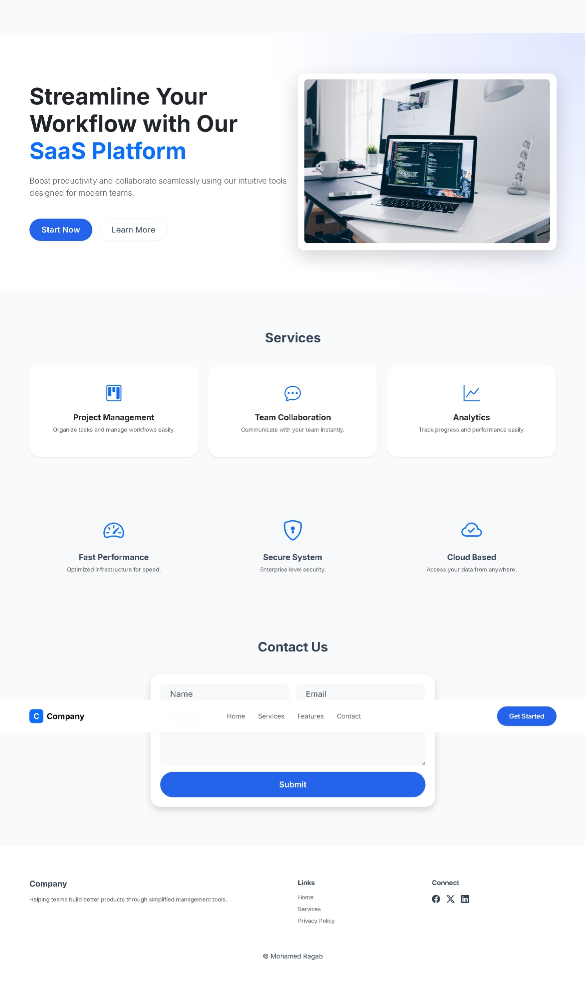

# SaaS Landing Page

A modern and responsive SaaS landing page built using **HTML, CSS, Bootstrap and JavaScript**.  
This project is designed for startups, SaaS products, and digital services that need a clean and professional landing page.

---

## 🚀 Features

- Modern and clean UI design
- Fully responsive for all devices
- Smooth scrolling navigation
- Animated sections
- Clean and organized code structure
- Optimized layout for SaaS products

---

## 🛠 Technologies Used

- HTML5
- CSS3
- Bootstrap 5
- JavaScript
- Bootstrap Icons

---

## 📂 Project Structure

saas-landing-page/
│
├── index.html
│
├── css/
│ └── style.css
│
├── js/
│ └── style.js
│
└── img/
└── images used in the project

---

## 📸 Sections Included

The landing page contains the following sections:

- Navigation Bar
- Hero Section
- Services Section
- Features Section
- Contact Form
- Footer

---

## 🌐 Live Demo

The project can be viewed live using **GitHub Pages**.

Example link:
https://ragabcodes.github.io/saas-landing-page/ 

## 👨‍💻 Author

**Mohamed Ragab**

- GitHub: https://github.com/ragabcodes
- LinkedIn: https://www.linkedin.com/in/mohamed-r-ragab

Electrical Engineering Student and aspiring Full-Stack Web Developer focused on building modern web applications and landing pages.

---

## 📄 License

This project is open-source and available for learning and portfolio purposes.

## Preview

